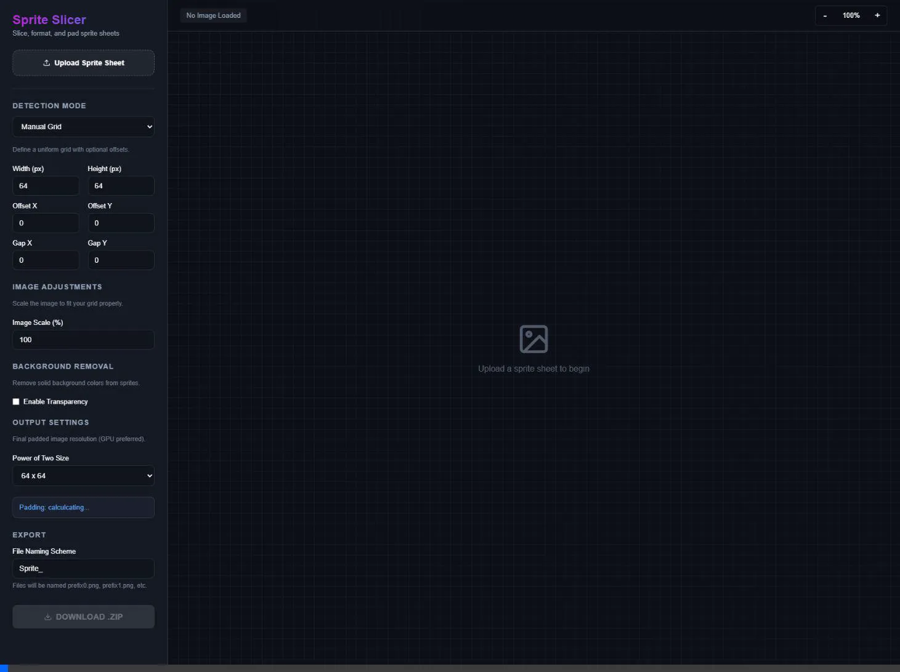

# ✂️ Sprite Slicer: Master How-To Guide

Welcome to **Sprite Slicer**, the ultimate browser-based tool for slicing up heavily-packed sprite sheets correctly, quickly, and securely.

Below you'll find an automated demonstration and step-by-step instructions on utilizing the new advanced layout features, including *Manual Grid Offsetting* and *Auto-Extracting Sprites (Islands)*.

## 📺 Video Walkthrough

Watch the interface tour below to familiarize yourself with the tools:

---

## 1. Getting Started
To get started, simply click the **Upload Sprite Sheet** button in the sidebar and choose an image from your computer. Your image will appear on the workspace canvas. 

💡 *Tip: Use the `+` and `-` zoom controls on the top right to properly inspect exactly where the bounding boxes align with your characters.*

## 2. Choosing a Detection Mode
Sprite Slicer supports 3 powerful detection modes depending on how your uploaded sprite sheet is structured. You can find these under the **Detection Mode** dropdown.

### Mode 1: Manual Grid (Advanced)
Perfect for uniformly spaced spreadsheets that use margins, gaps, or divider gridlines.

- **Width / Height**: Sets the raw resolution of the exported character file.
- **Offset X / Y**: Push the starting point inward to skip past margins or outer bounds.
- **Gap X / Y**: Tell the slicer to skip over inner grid borders between frames (e.g., if you have a 2px grey strip between each character, setting `Gap X: 2` will properly jump over it every frame).

### Mode 2: Auto-Extract (Islands)
The crown jewel of Sprite Slicer. Use this if your characters are separated by a plain color or transparency! It perfectly detects contiguous non-background elements and hugs their real borders dynamically.

> [!TIP]
> **How to use Islands effortlessly:**
> 1. Select the **Auto-Extract (Islands)** mode.
> 2. Skip down to **Background Removal** and check **Enable Transparency**.
> 3. Click the Color Picker and set it to match the sheet's raw background color.
> 4. The sprites are automatically masked and cropped on Canvas, and bounded beautifully in green!

### Mode 3: Auto-Extract (Drawn Borders)
Does your sheet have red or blue bounding boxes already drawn around the characters? Toggle this mode, set the expected border color with the picker, and the tool will slice everything perfectly out of the boxes. Selecting *Exclude Frame Line* drops the drawn border from the final exports!

## 3. Power-of-Two Export Details
A core requirement for most modern game engines (Unity, Unreal) is **Power-of-Two padding (POT)**. 

1. Go to the **Output Settings** panel.
2. Select your desired Power of Two Size layout structure (e.g., `64x64`, `128x128`).
3. The slicer will automatically take the tightest-fit cropped bounds of the sprite (whether it's `22x34` or `44x48`) and center it beautifully within the `64x64` POT canvas.

## 4. Exporting Your Sprites
Ready to lock them in?

1. Give the exports a neat prefix name (e.g., `PlayerWalk_`).
2. Click the shiny **Download .ZIP** button!
3. All bounding boxes recognized inside your canvas will be separated, centered securely within the POT selection, and zipped instantly.
